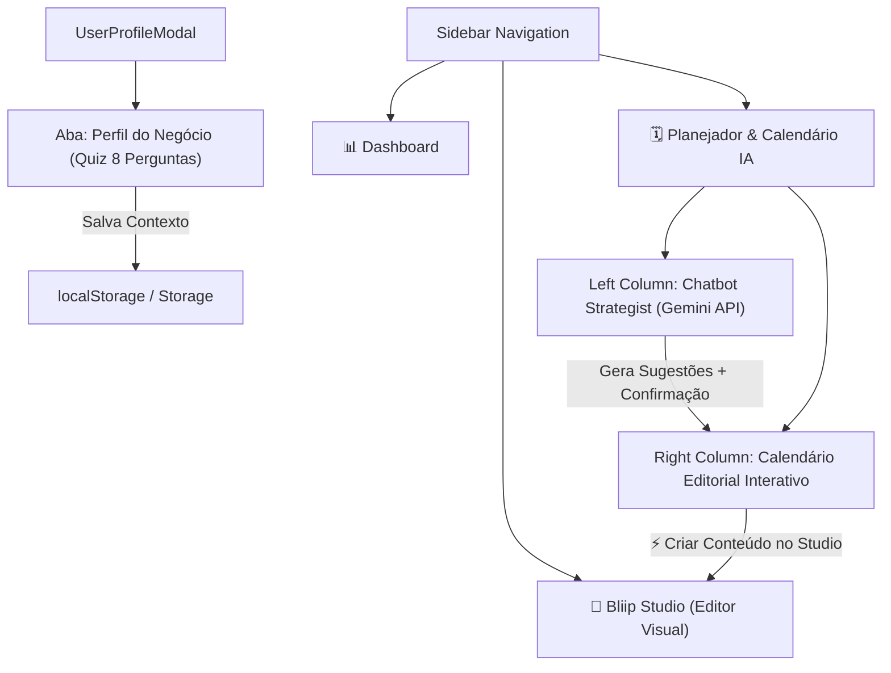

# Plano de Arquitetura & Implementação: Planejador de Conteúdo IA & Calendário Estratégico

Este documento detalha o plano técnico para evoluir a arquitetura do **Bliip**, introduzindo o **Planejador Estratégico de Longo Prazo** com **IA Gemini**, o **Quiz de Perfil do Negócio**, o **Menu Lateral de Navegação (Sidebar)** e a criação automática de carrosséis a partir das ideias agendadas.

---

## 🎨 Visão Geral da Nova Arquitetura

---

## 🛠️ O Que Será Desenvolvido (Apenas Localmente)

### 1. Atualização do Modelo de Dados (`src/types/carousel.ts` & `src/lib/storage.ts`)
- **`BusinessProfileQuiz`**:
  - Nicho / Especialidade.
  - Resultados que entrega.
  - Principais dores da audiência.
  - Tipos de conteúdo desejados.
  - Provas sociais em imagem/vídeo disponíveis.
  - Maior dor do cliente.
  - Nome do método/framework/ferramenta ensinado.
  - Como funciona o método.
- **`PlannedContentIdea`**:
  - `id`, `date` (YYYY-MM-DD), `title`, `description`, `recommendedStyle`, `recommendedSlideCount`, `slidesContent`, `status` (`planned` | `created`), `carouselId`.
- **Persistência**: Funções em `storage.ts` para salvar o quiz do negócio e as ideias planejadas.

---

### 2. Menu Lateral de Navegação (`src/components/SidebarNav.tsx` [NOVO])
- Substitui a navegação simples por uma **Sidebar recolhível e elegante**:
  - 📊 **Dashboard**: Visão geral de carrosséis, estatísticas e filtros.
  - 🎨 **Studio (Criador de Posts)**: Editor visual de slides e canvas.
  - 🗓️ **Calendário & IA Strategist**: Nova tela de planejamento.

---

### 3. Quiz de Perfil do Negócio (`src/components/UserProfileModal.tsx`)
- Adicionar a aba **"Perfil do Negócio (IA)"** dentro do modal de perfil.
- Formulário estilo quiz com 8 campos (combos, seleção de opções, áreas de texto) que alimentam o contexto de conhecimento da IA.

---

### 4. API de Planejamento com Gemini (`src/app/api/ai/planner/route.ts` [NOVO])
- Rota Next.js comunicando com a **Google Gemini API** (`@google/generative-ai`).
- Envia o **Quiz do Negócio** como Prompt do Sistema (System Instruction).
- Suporta chat interativo e retorna planos estruturados em JSON quando o usuário aprova o agendamento.

---

### 5. Tela do Planejador de Conteúdo (`src/components/ContentPlanner.tsx` [NOVO])
- **Coluna da Esquerda**: **Chatbot Estrategista IA**:
  - Conversa sobre estratégia de conteúdo (1 semana, 1 mês ou 3 meses).
  - Pergunta ao usuário: *"Deseja distribuir estas sugestões no seu calendário de conteúdo?"*.
- **Coluna da Direita**: **Calendário Editorial Mensal/Semanal**:
  - Exibe os cards de posts nos dias correspondentes.
  - Modal de detalhes com o botão **"⚡ Criar Conteúdo no Bliip Studio"**.

---

### 6. Transição Automática do Calendário para o Bliip Studio (`src/hooks/useCarouselState.ts`)
- Função `handleCreateCarouselFromPlannedIdea(idea)`:
  - Cria automaticamente o carrossel com os textos dos slides sugeridos pela IA.
  - Transiciona a navegação direto para o **Bliip Studio** no modo editor.

---

## 🛠️ Arquivos a Serem Criados / Modificados

| Arquivo | Ação | Descrição das Mudanças |
| :--- | :--- | :--- |
| `src/types/carousel.ts` | **[MODIFY]** | Adicionar tipos `BusinessProfileQuiz` e `PlannedContentIdea`. |
| `src/lib/storage.ts` | **[MODIFY]** | Adicionar persistência do Quiz do Negócio e conteúdos planejados. |
| `src/components/SidebarNav.tsx` | **[NEW]** | Menu lateral de navegação (Dashboard, Studio, Calendário). |
| `src/components/UserProfileModal.tsx` | **[MODIFY]** | Adicionar aba Quiz de Perfil do Negócio. |
| `src/app/api/ai/planner/route.ts` | **[NEW]** | Endpoint Rota API Gemini para o Chatbot Estrategista. |
| `src/components/ContentPlanner.tsx` | **[NEW]** | Tela do Planejador (Chatbot Esquerda + Calendário Direita). |
| `src/hooks/useCarouselState.ts` | **[MODIFY]** | Adicionar gerador de carrossel vindo da ideia agendada. |
| `src/app/page.tsx` | **[MODIFY]** | Integrar SidebarNav e roteamento entre Dashboard, Studio e Planejador. |

---

## 🧪 Validação Local

- `npx tsc --noEmit`
- `npm run build`
- Teste visual e funcional completo no ambiente local (`http://localhost:3000`).
- **Nenhum commit ou push para o Git/Vercel será feito.**
